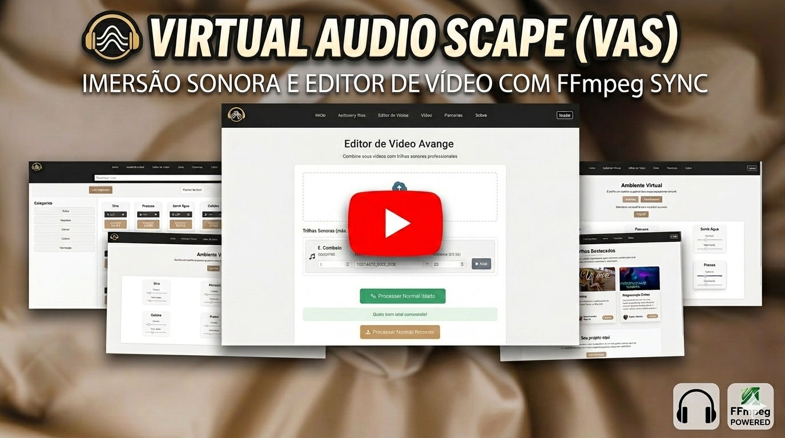

# 🎧 VAS - Virtual Audio Scape


---

## 🌐 Overview

**VAS (Virtual Audio Scape)** is a web platform for mixing and layering 
real-world sounds into immersive audio environments, with built-in 
video sync powered by FFmpeg.

Built for independent creators who want professional-quality soundscapes 
without expensive tools or a steep learning curve.

---

## 🎞️ Demo

<p align="left">
  <a href="https://youtu.be/3Pxvjlk-9Wg" target="_blank">
    
  </a>
  <br>
  <ins>Click on the image above to watch the full video on Youtube</b></ins>
</p>

---

## ✨ Features

| Feature | Description |
|---|---|
| **Sound Store** | Browse and download themed packs (Coffee Shop, Nature, City Life) |
| **Virtual Mixer** | Layer sounds, adjust speed, apply reverb, preview in real time |
| **Video Integration** | Upload a video and sync a soundscape via FFmpeg server-side |
| **User Accounts** | Register, log in, and access your personal sound library |

---

## 🏗️ Architecture

<picture>
  <source media="(prefers-color-scheme: dark)" srcset="./assets/arquitechture_light.png">
  
</picture>

The backend runs on Node.js + Express, with MySQL handling users, 
sound packs, and purchase history. The most relevant technical 
decision here was running FFmpeg server-side: when a user syncs 
a soundscape to a video, Express pipes the files through FFmpeg 
and returns the rendered output, keeping quality consistent 
regardless of the client's device.

The database schema follows an ownership model - users own packs, 
packs contain tracks - designed to support individual or bundled 
purchases down the line.

---

## 🚀 Getting Started

```bash
git clone https://github.com/lucas-morim/vas-studio.git
npm install
```

Create a `.env` file:

```env
DB_HOST=localhost
DB_USER=root
DB_PASS=your_password
DB_NAME=vas
```

```bash
npm start
# http://localhost:3000
```

---

## 🧩 Tech Stack

**Backend**: Node.js, Express, MySQL, FFmpeg  
**Frontend**: HTML5, CSS3, JavaScript, Bootstrap

---

## 🧭 Planned Improvements

- User dashboard for managing sound collections
- Visual timeline for the mixing interface
- Cloud storage for user-generated environments
- Collaborative sound creation

---

## 💡 About

Academic project built individually, focused on integrating 
server-side multimedia processing (FFmpeg) into a full web 
application stack.
